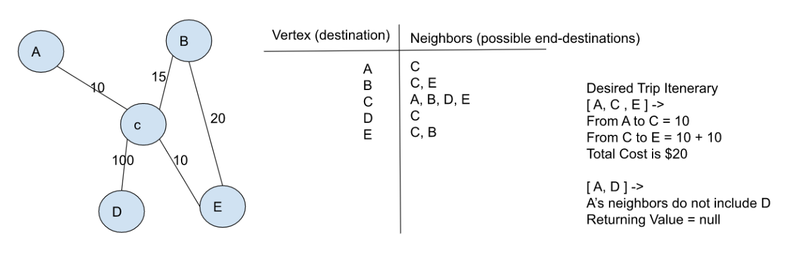

# Graph Implementation

  Implementing a graph and representing the graph as an adjacency list

## API

  1. **addVertex**: Add a node to the graph
  - Arguments: value
  - Returns: The added node
  - Time efficiency: O(1), utilizing Map object to insert a vertex into a list
  - Space efficiency: O(N), a vertex is created for each input
  
  2. **addEdge**: Adds a new edge between two nodes in the graph. If specified, assign a weight to the edge. Both nodes should already be in the Graph
  - Arguments: 2 nodes to be connected by the edge, weight (optional)
  - Returns: nothing
  - Efficiency: O(1), validation of the give nodes take O(1) using the Map object and adding an edge takes O(N) space because an edge is created 

  3. **getNodes**: Traverses the graph to return a collection (set, list, or similar). Empty collection returned if there are no nodes
  - Arguments: none
  - Returns all of the nodes in the graph
  - Efficiency: O(N), traversal of adjacency list is done once and space efficiency is O(N) as a collection representing the nodes in the graph

  4. **getNeighbors**: Includes the weight of the connection in the returned collection. Empty collection returned if there are no nodes
  - Arguments: node
  - Returns a collection of edges connected to the given node
  - Efficiency: O(N) traversal through the given node's children while space efficiency is O(N) because an array the size of the given node's children is returned
  
  5. **size**: Returns the total number of nodes in the graph. 0 if there are none
  - Arguments: none
  - Returns number representing total nodes in graph
  - Efficiency: O(1) because a length property within the graph class is being returned while space is also O(1)

  6. **depthFirst**: Traverse an entire graph
  - Arguments: Node (starting point of search)
  - Return: A collection of nodes in their pre-order depth traversal order and display a collection of the vertexes
  - Efficiency: O(N) requires traversal of the entire graph, includes all vertexes and edges. Space complexity is O(N) as it is dependent on the size of the graph being traversed

  7. **breadthFirst**: Traverses the graph in the order of a starting node then it's neighbor nodes
  - Arguments: starting vertex
  - return: A collection of nodes in the order they were visited
  - Efficiency: Worst case is O(N^N) when traversing a connected graph. Traverse each node of the tree and traverse each edge for each vertex N times
  - Space efficiency: O(N), a Set is returned that includes all the graph's vertexes 

  8. **businessTrip**: Determine whether a trip is possible with direct flights and how much it would cost. In a graph, a vertex represents a destination and an edge connecting destinations represent the cost of travel shared between two vertexes. 
  - Arguements: Graph & an array of city names
  - Return: Integer representing the cost of the trip (if possible) or null (if not possible)
  - Time complexity: 
  - Visual Of the Problem Domain
  - 
  - Efficiency: Worst case is O(N^N) in the scenario that the business trip included all destinations in a graph and the graph was a connected graph (all vertexes are connected). In a normal case, O(N ^ M) N representing the number of nodes in the input array and M representing each edge that must be evaluated for the nodes
  - Space efficiency is O(1) since a primitive data structure has been returned and the given inputs were utilized to calucate a value rather than using a data structure of the same size as the input

