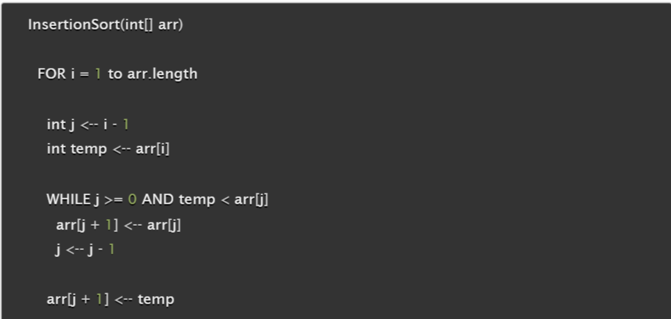
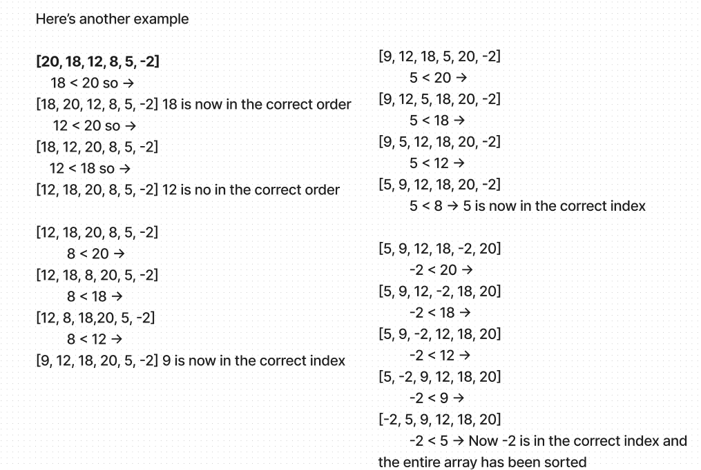

# Code Challenge 20 

## How to trace and step through an algorithm

## Problem Set Through
Problem Step-Through

First, a function called InsertionSort is declared and the function takes an integer array as a parameter. 

Now we enter a for loop with variable assignment for “i” which will be assigned to the second element in the given array

A j variable and temp variable are initialized. J represents the element before i in the array. Temp is a holder for i variable

Next we see a while loop that will iterate until the variable j is less than 0 or until temp is less than the value of arr[j]

Inside the while loop, the array element preceding the j index is being reassigned to the element at j index

Once reassigned, the j variable will reassign itself to the index at j -1. Now that j is reassigned,

# Testcases

FOR i = 1 to arr.length // 1 -> 2 -> 3 -> 4 -> 5

int j = i -1 // 0 -> 1 -> 2 -> 3 -> 4
int temp = arr[i] // 4 -> 8 -> 23 -> 42 -> 16 -> 15

WHILE j >= 0 AND temp < arr[j]
arr[j + 1] = arr[j]; 
j = j -1 

arr[j + 1] = temp 

**testcase #1 [8, 4, 23, 42, 16, 15]**

  1. [8, 4, 23, 42, 16, 15] // first iteration swap
    in this iteration,
    a. i = 1
    b. j = 0 
    c. temp = second value in the above array, 8
  2. These values meet the condition to enter the while  loop thus the first element is reassigned to the second element in the array. 
  3. After that, j is subtracted by 1 to completed the next step which is assigning the second element in the array to the value of the temp variable
  4. Now the values of j and temp do not meet the while loops conditionals and these steps repeat for the second iteration of the for loop

  1. [4, 8, 23, 42, 16, 15] // Second, no swaps
  in the 2nd iteration,
    a. i = 2
    b. j = 1
    c. temp = third value in the above array, 23
  2. These values do not meet the while loop conditionals so the for loop continue to iterate 

  1. [4, 8, 23, 42, 16, 15] // Third iteration, no swaps - above two steps are repeated

  1. [4, 8, 23, 42, 16, 15] // Fourth iteration, swaps 42 and 16 in this 4th iteration,
    a. i = 4
    b. j = 3
    c. temp = second value in the above array, 16
  2. These values meet while loop conditions and the element at index i will be reassigned to the element at index j
  3. Now the array looks like this [4, 8, 23, 42, 42, 15]
  j is going to be reassigned to 2 and the element at index j + 1 will be reassigned to the temp value
  4. Now the array looks like this [4, 8, 23, 16, 42, 15]

  1. Steps 2 and 3 will repeat until j is less than 0 and temp is equal to element at index j

The end result should be [4, 8, 15, 16, 23, 42]

**Here's a walk through of more examples:**

