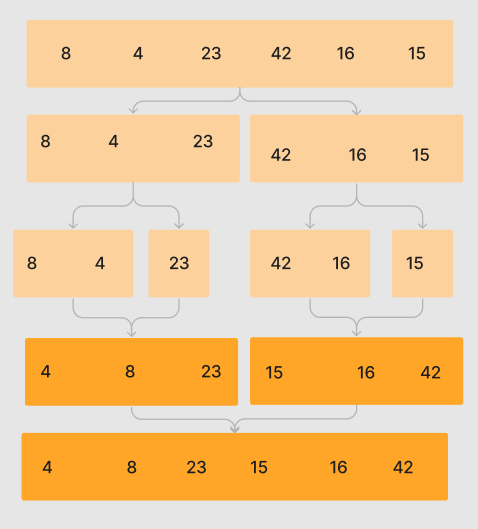

# Merge Sort

  Merge Sort uses "divide and conquer" where the given array is to be split in half recursively until it can no longer be spit. The small sub-arrays are sorted then merged. Each merge leads to sorting of the already sorted sub-arrays. This is repeated until the sub-arrays are completely merged and the returning array is completely sorted

### Algorithm
  1. Check if the left index is less than the right index
  2. Now divide the entire array leaving us with two sub-arrays
  3. Now repeat the splitting with the two sub arrays
  4. Continue until splitting can not longer occur
  5. Start merging the elements again based on comparison of element size
  6. Continue merging until entire array is complete 

## Big-O-Notation
  Time complexity: O(nlog(n)) because sorting - consistent algorithm 
  Space conplexity: Requires extra space