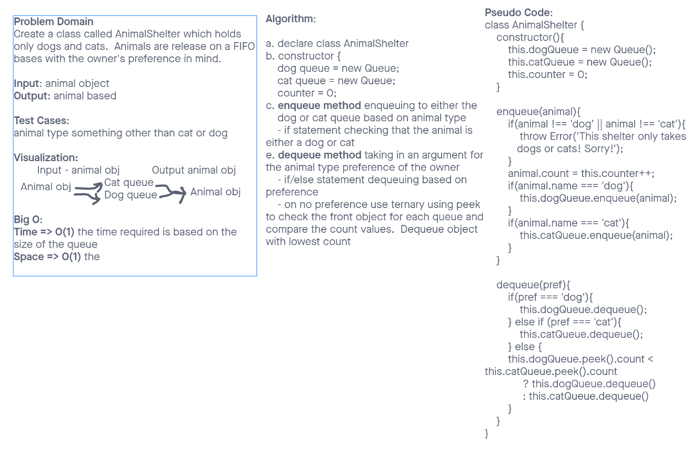
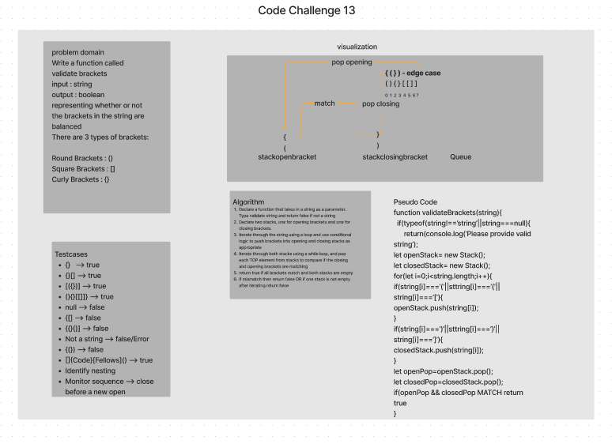
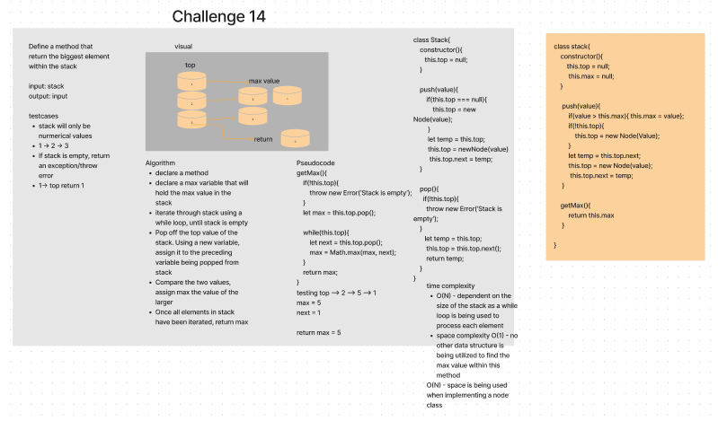

# Stacks & Queues

## Author: Elaine Huynh

## Challenge

    Using a Linked List as the underlying data storage mechanism, implement both a Stack and a Queue classes. Create a Node class that has required properties.

    Create a pseudo Queue class using two stacks to implement the enqueue() and dequeu() methods within the class

    Create a class called AnimalShelter that holds dogs and cats - this class will operate using FIFO approach

## Approach & Efficiency

    Linked list are efficient for inserting when inserting to the front or end of a list is required. When building the push/enqueue methods, use a time complexity of O(1). Utilize a back pointer in the Queue class to make enqueueing and dequeueing more efficient.

## API

    push: Stack method to add a node to the TOP of the stack

    pop: Stack method to remove a node to the TOP of the stack

    peek: Returns the value of the node at the TOP of a stack OR the FRONT of a queue

    isEmpty: Return a boolean whether the stack/queue is empty

    enqueue: Time complexity of O(1) - add a new node to the back of a queue and move the back pointer to appropriate spot

    dequeue: Time complexity of O(1) - remove the front node of a queue and reassign the front  as needed

    pseudoQueue.enqueue: Time complexity is O(1), uses a stack to store all of the values into the pseudo class

    pseudoQueue.dequeue: Time complexity is O(2N) which is O(N) - using two while loops to reverse the stack and then reverse the stack again to return to it's original order
    WhiteBoarding: 
    

    AnimalShelter.enqueue: Takes in an animal(either dog or cat object) and adds it to the queue

    AnimalShelter.dequeue: Takes in a pref (either dog or cat, if it is neither than return null). Return either dog or cat based on pref 

    WhiteBoarding: https://cfjun.invisionapp.com/freehand/Code-Challenges-lAqVy8AYU?dsid_h=7eed01026ead4a7[…]d8d5b53a2d68dd55623ef70f1501a7ddebc0f2a804ee49b2e2a5ae5ffb

    https://projects.invisionapp.com/freehand/document/HGwZXdbcQ
    
# Validate Brackets Challenge Summary

## Whiteboard process

# Approach & Efficiency
    1. Use two stacks to track opening and closing brackets
    2. Match each bracket in each stack
    3. If all brackets match then return true otherwise return false

    - Efficiency: Approach utilizes two loops, Once to iterate the string and another to iterate through both stacks. Time compelixty is O(N) as input directly effects processing time of algorithm

## Solution
    - Test cases:
        - [({})] --> true
        - (){}[[]]} --> true
        - null --> false
        - {[] --> false
