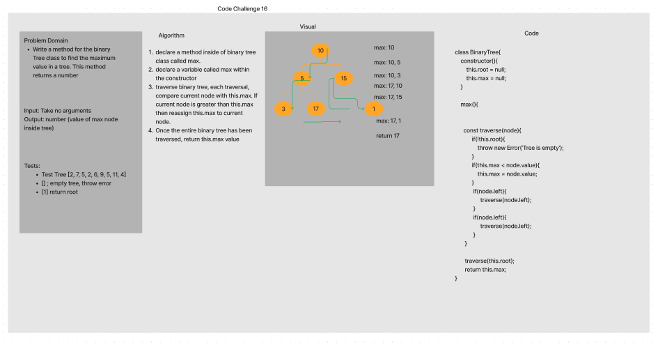

# Trees
<!-- Short summary or background information -->
  Organized by hierarchy (hierarchical) - have a root and children 
    that act as subtrees from there on

  Terminology
    K-ary: Meaning 
      - Examples of Trees: family tree, DOM
    - Binary Tree: Each node has up to two children
    - Balanced: When nodes are inserted from the top to bottom and only one partially filled level
    - leaf: node with no children (nodes that live on the lowest depth of the tree)
    - path: the route taken from the starting node to an ending node (root -> leaf)
    - path weight: ask for clarification. Can be generalized or tailored but an example oculd be the sum of all nodes from the root to leaf
    - binary search tree: sorted binary tree. Lesser values to the left larger to value to right. Impacts efficiency

## Challenge
<!-- Description of the challenge -->
  A Node class that has properties for the value stored in the node, the left child node, 
  and the right child node.
  **Binary Tree**
    Create a Binary Tree class
    Define a method for each of the depth first traversals:
    pre order
    in order
    post order which returns an array of the values, ordered appropriately.
  **Binary Search Tree** Create a Binary Search Tree class
    This class should be a sub-class (or your languages equivalent) of the Binary Tree Class, with the following additional methods:
    Add
    Arguments: value
    Return: nothing
  **Adds a new node with that value in the correct location in the binary search tree.**
    Contains
    Argument: value
    Returns: boolean indicating whether or not the value is in the tree at least once.
    **Write a method for the Binary Tree class to find maximum value**
    maxValue
    Arguements: none
    Returns: number

## Approach & Efficiency
<!-- What approach did you take? Why? What is the Big O space/time for this approach? -->
  Traversals: Time efficiency is O(N) or O(v + e) because traversal involves reading each of the vertices and edges within a tree

  Insertion to a BST: Time efficiency is O(LogN) because the tree is sorted and the hierarchial organization
  of a tree reduces the amount of nodes and edges the algorithm may have to examine. 

  find Max Value: Time efficiency is O(N), traversal of all nodes and edges within the tree
## API
<!-- Description of each method publicly available in each of your trees -->
**Binary Tree class**
  pre order: define each node in a tree from the <root> <left> <right> subtrees 
  in order: Define each node in a tree using the order <left> <root> <right>
  post order which returns an array of the values, ordered appropriately: Define each node in a tree using the order <left> <right> <root>

**Binary Search Tree class**
  Add : takes in a value as an arguement and returns nothing, but inserts a node into the right place of a BST

**WhiteBoarding Process**
